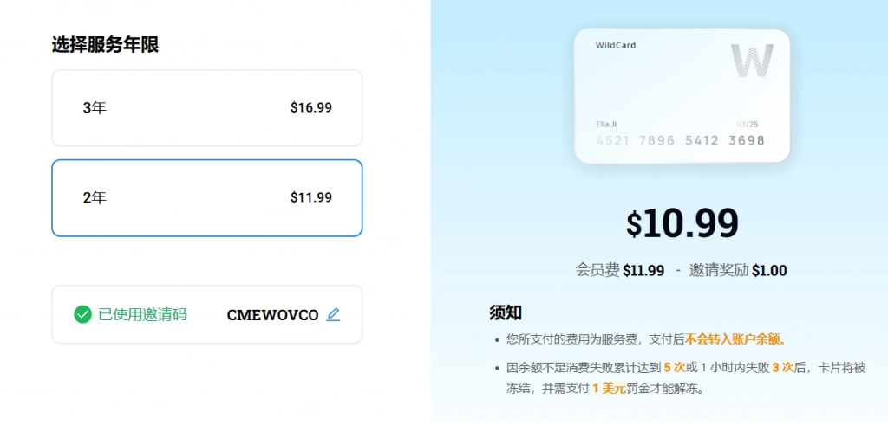

# Super Grok充值指南：30美元解锁AI顶级推理能力

---

如果你在用Grok的免费版，可能已经遇到过这种情况：正想深挖一个复杂问题，系统提示"今日深度搜索次数已用完"。或者看到别人炫耀的语音对话、3D建模功能，你的账户却灰着。其实只需要一张虚拟卡，30美元/月就能把这些限制全解除——问题是，国内用户怎么给Super Grok充值？这篇文章就是把整个流程掰开了讲清楚。

---

## 先搞清楚Super Grok到底能干啥

Grok是马斯克xAI公司用20万块H100训出来的AI，基础版免费够用，但真正的狠活儿都藏在Super会员里：

**1. 深度搜索（DeepSearch）无限用**  
免费版每天只能用几次，升级后可以随便刷X平台和全网数据，生成结构化报告。比如你要写行业分析，它能帮你把散落的信息整理成表格，省下三四个小时人工筛选时间。

**2. 思维模式（Think）不限次**  
这个功能就像给AI装了个"草稿本"，遇到数学证明、代码调试这种需要分步推理的任务,它会一步步展示思考过程。免费版用几次就卡了，付费版直接敞开用。

**3. 抢先体验新功能**  
最近xAI在测端到端语音模式（像跟真人对话那种），还有3D动画生成工具，Super会员能第一批试用。如果你是搞创作或开发的，这些功能说不定能直接用进项目里。

**4. API额度更高**  
开发者调用Grok 3模型时，免费账户每月就几千次请求，Super会员直接给你加到几万次起步，适合跑批量任务。

## 为什么国内充值这么麻烦

Grok只接受国际信用卡（Visa/MasterCard），而且必须是支持美元扣款的卡。国内的银联卡或双币卡大概率会被拦截，主要原因有两个：

- **地区限制**：xAI系统会检测账单地址和IP归属地，国内地址直接过不了风控。
- **货币转换**：即使绑卡成功,人民币转美元的手续费也得多花十几块。

所以大部分人会选虚拟信用卡这条路——开一张海外虚拟卡，专门用来订阅AI服务。说到这里，👉 [想快速拿到一张能用的虚拟卡？这个方案一分钟搞定，还省去汇率损失](https://shaoyumi.com/buy/66)。

## 充值全流程（实测有效）

### 第一步：搞定虚拟卡

推荐用WildCard，原因很简单：不用实名认证，支持支付宝/微信充值，而且专门针对ChatGPT、Claude、Grok这类AI服务优化过。

1. 打开WildCard官网（bewildcard.com），手机号注册。
2. 支付开卡费（大概10美元左右，两年有效期）。
3. 开卡成功后，页面会显示一张MasterCard的卡号、有效期和CVV码，截图保存好。

**划重点**：注册时输入邀请码**CMEWOVCO**能省1美元，虽然不多但蚊子腿也是肉。

### 第二步：给虚拟卡充值

在WildCard后台找到"充值"按钮，用支付宝或微信转30美元进去（实时汇率自动换算，比银行换汇划算）。充完钱别急着关页面，顺手把账单地址复制下来——这是WildCard自动生成的美国免税州地址，待会绑卡要用。

### 第三步：绑定到Grok账户

1. 登录grok.com，点右上角的"Go Super"。
2. 填写支付信息：把刚才截图的卡号、有效期、CVV码照抄进去。
3. 账单地址直接粘贴WildCard给的美国地址（比如俄勒冈州或特拉华州的）。
4. 确认扣款，等几秒钟就能看到"Super Grok会员"的标识亮起来。

**注意事项**：
- 绑卡时把梯子切到美国节点，其他地区可能触发风控。
- 虚拟卡余额够30美元就行，多充的钱可以留着下个月续费或者订阅别的服务。
- 建议关掉自动续费：进账户设置→订阅管理→取消自动扣款，免得下次忘充值导致会员中断。

## 几个实际使用场景

**写长文的人**：开着深度搜索功能，让Grok帮你从X平台和Google Scholar扒资料，十分钟能出一份带引用来源的初稿大纲。

**搞技术的人**：用Think模式调试代码，它会把每一步的逻辑错误指出来，比自己盲改快多了。

**做营销的人**：分析竞品数据时，DeepSearch能把对方最近三个月的热门帖子、用户反馈全拉出来，省掉手动爬数据的功夫。

## 常见问题

**Q：虚拟卡会不会突然失效？**  
A：WildCard有效期两年，只要账户余额够扣月费就不会断。如果担心，可以设置余额预警，低于10美元时自动发短信提醒。

**Q：30美元值不值？**  
A：对比ChatGPT Plus（20美元/月但功能单一）和Claude Pro（20美元/月但API额度少），Grok的性价比其实挺高——尤其是需要实时数据检索的场景，它能直接联网抓取X平台内容，这点别家做不到。

**Q：不想续费了怎么退？**  
A：订阅后7天内没用过高级功能，可以联系xAI客服申请全额退款。超过7天就按已使用天数扣费，剩下的不退。

---

## 总结一下

Super Grok的充值逻辑其实就三步：开虚拟卡→充美元→绑定账户。整个流程十分钟搞定，唯一需要注意的就是网络环境和账单地址别填错。如果你经常用AI工具处理复杂任务，30美元/月能换来无限次深度搜索和思维推理，这笔账怎么算都不亏。👉 [现在就去拿一张支持Grok的虚拟卡，今天充值明天就能用上全功能](https://shaoyumi.com/buy/66)。
