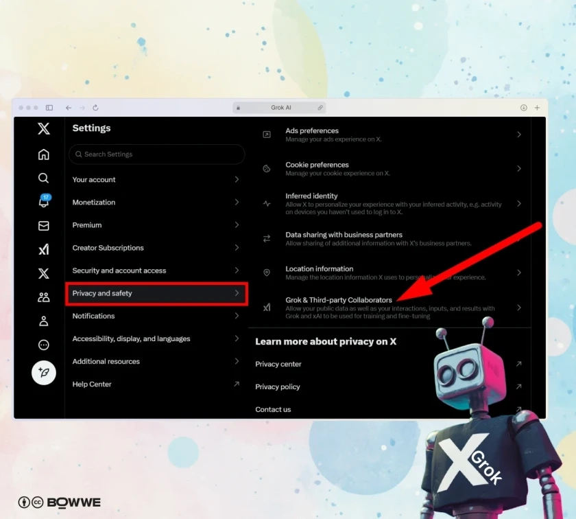
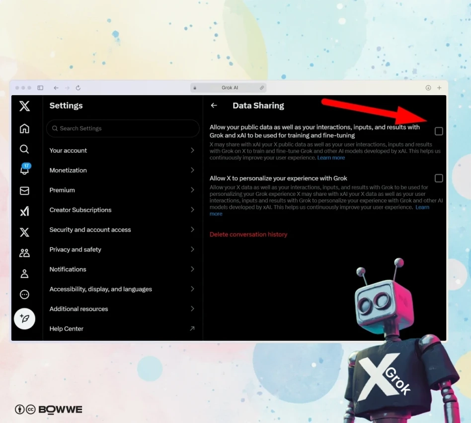
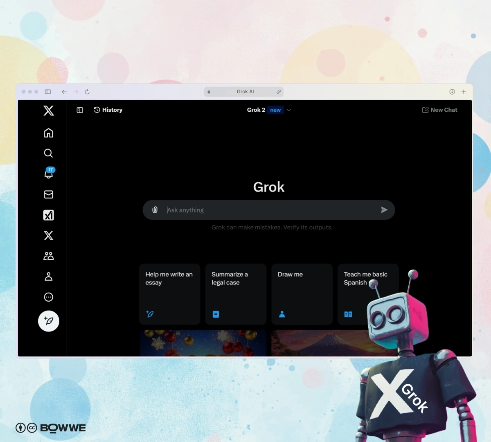
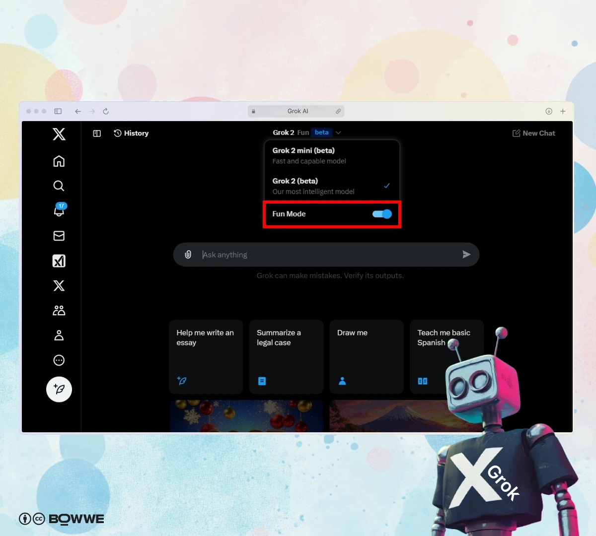
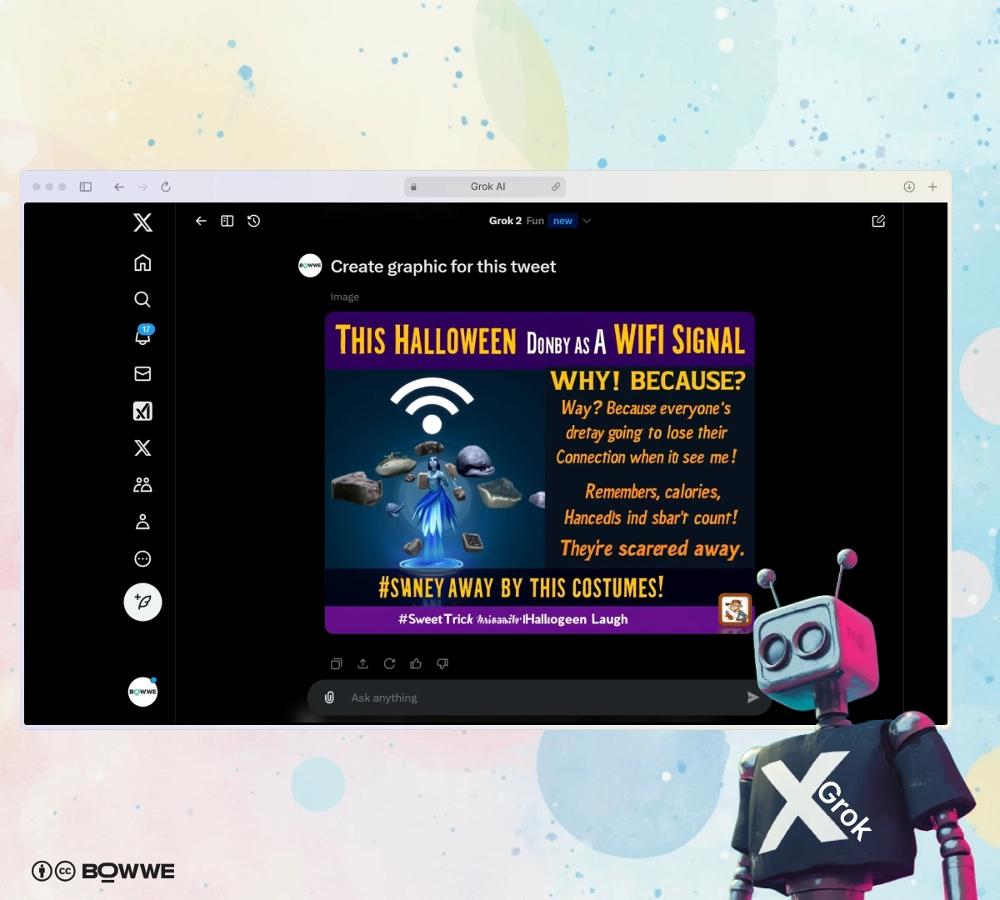
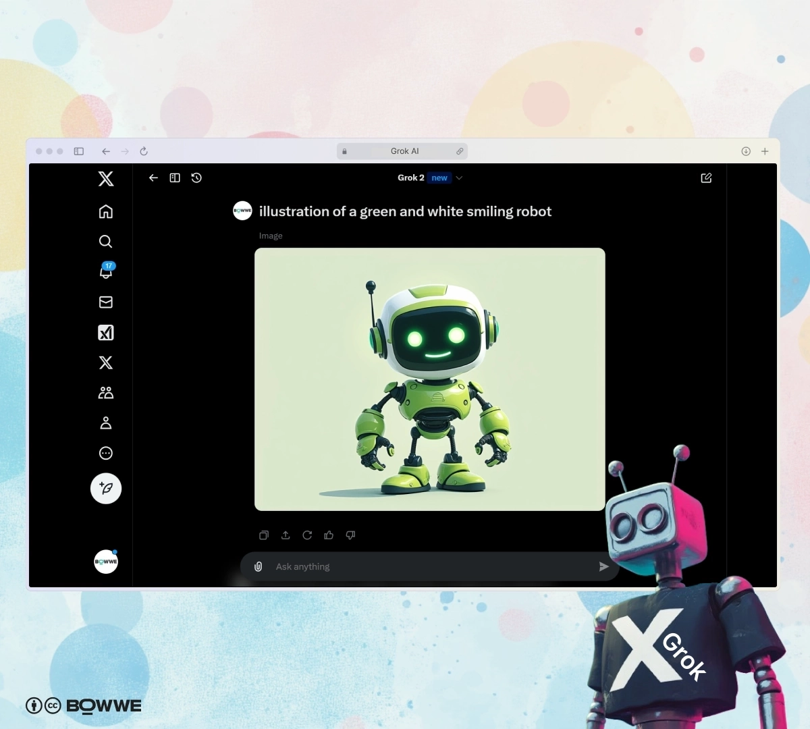
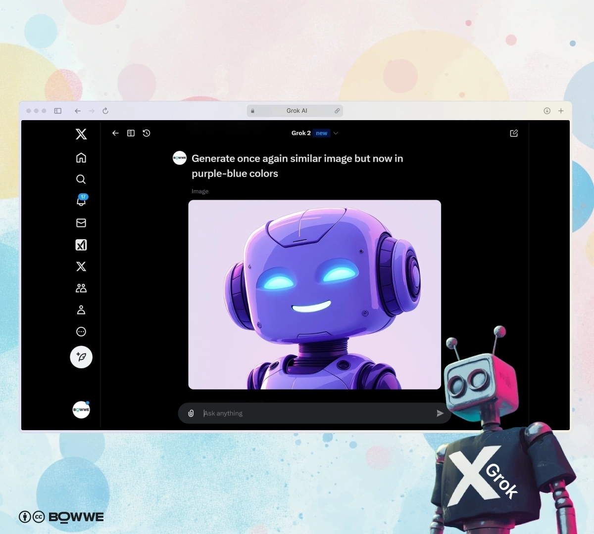
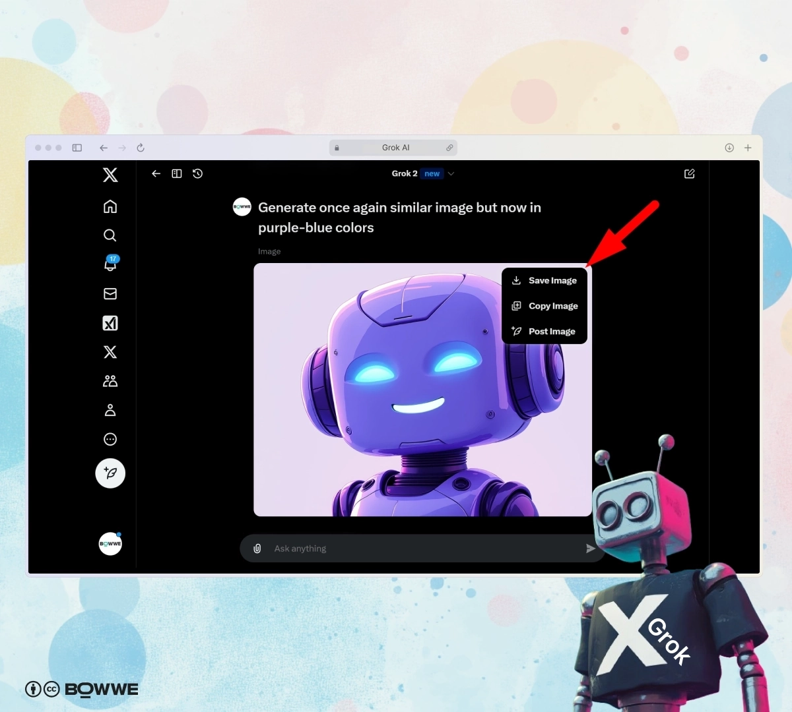
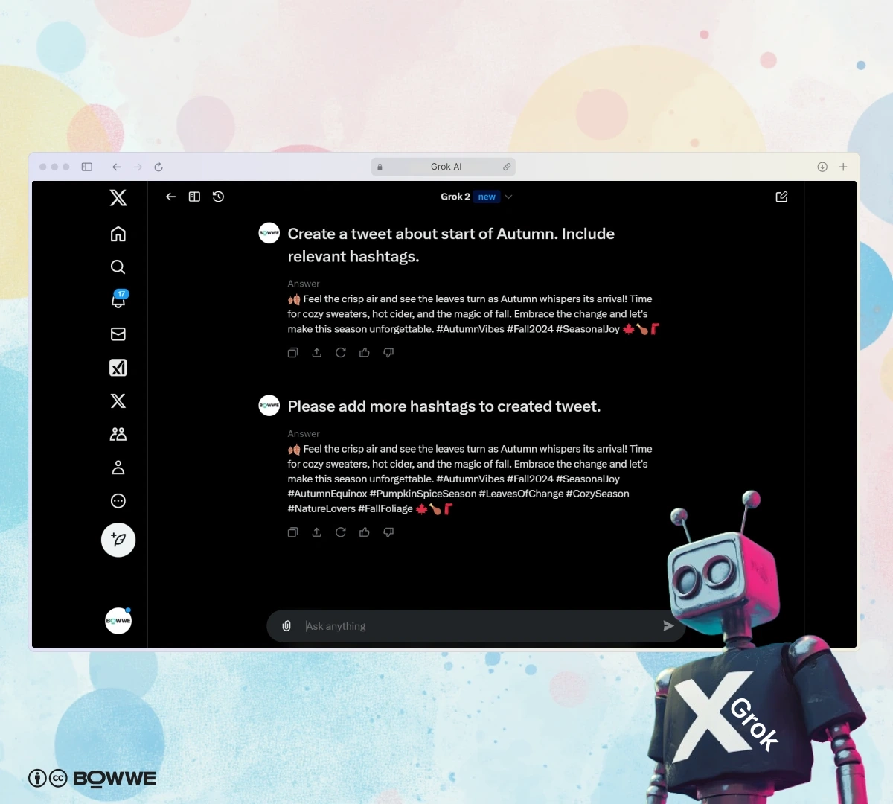
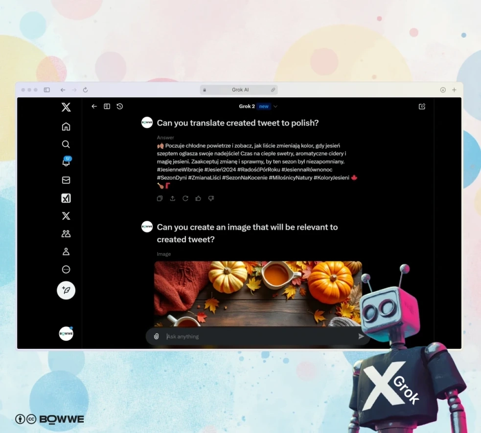

# 从AI图像生成到推文创作:Grok AI完全使用指南

---

想知道Grok AI和其他AI聊天机器人有什么不同?作为埃隆·马斯克旗下xAI公司的最新产品,Grok正在X平台(前身是Twitter)上掀起波澜。如果你正在寻找一个既能生成创意内容、又能实时追踪热点的AI助手,不妨花几分钟了解一下这个"反叛"的新工具——它可能正是你的品牌在社交媒体上脱颖而出的秘密武器。

---

## Grok是什么?

Grok是埃隆·马斯克的xAI公司开发的AI聊天机器人。官方介绍说它是"一个带着幽默感和叛逆精神的AI搜索助手",直接集成在X平台上。**这种集成让它能访问实时的公开推文,用最新的信息和洞察回答各种问题。**

说实话,Grok最大的特点就是"不那么政治正确"。它的内容审核比其他AI宽松得多,被标记为"反觉醒"。这意味着你可以创作更广泛的内容——当然,这种自由也带来了一些挑战,比如潜在的偏见和偶尔出现的不准确信息。

最初,Grok允许用户自由生成公众人物的图像,这引发了关于数字伦理和错误信息的争论。为了回应这些担忧,现在添加了一些限制,禁止使用真实人物和争议性符号创建图像。尽管如此,**Grok的AI图像生成器仍然比竞争对手给用户更多的创作自由。**

## 关于Grok 3

Grok 3是xAI最新的AI模型家族,专门设计用来推动推理、问题解决和通用智能的边界。它有多个版本,包括Grok 3和更轻量级的Grok 3 Mini(后者优先考虑速度而非准确性)。xAI声称Grok 3在关键基准测试中超越了OpenAI的GPT-4o等领先模型,特别是在高级数学(AIME)和复杂科学推理(GPQA)方面。

这个模型家族的一个关键进步是引入了专注推理的变体——Grok 3 Reasoning和Grok 3 Mini Reasoning。这些模型在生成答案之前会系统地分析问题,通过验证自己的结论来减少错误,特别适合数学、科学和编程等技术领域。用户还可以通过Big Brain模式进一步提高准确性,该模式为复杂查询启用更深层的计算推理。

如果你需要一个既能处理技术问题、又能实时追踪社交动态的AI工具,👉 [Grok Super会员一个月成品号让你立即解锁全部高级功能,无需等待审核](https://shaoyumi.com/buy/66),直接开始探索这个强大的AI助手。

## Grok是如何训练的?

**和今天大多数大型语言模型(LLM)一样,Grok-1由xAI在互联网上公开可用的各种文本数据上进行预训练。**这种广泛的预训练提供了一个涵盖广泛主题的知识库。但Grok的特别之处在于它持续从X的用户生成内容中学习,让它能跟上最新的趋势和对话。**不过,因为Grok是在用户生成的内容上训练的,它有时可能会反映这些数据中存在的偏见或错误信息。**

### 如何阻止与Grok AI共享你的信息?

如果你担心隐私,不想让你的推文用于训练Grok AI,可以这样退出:

- 进入X个人资料左侧面板的"设置和隐私"
- 导航到"隐私和安全",向下滚动到"数据共享和个性化"类别

- 从列表中选择"Grok"
- 选择退出与Grok共享你的推文和任何信息的协议

另外,你可以通过将账户设为私密来防止你的推文被使用。这样,你的内容就不会被Grok AI用于训练。

## Grok AI和Grok 3的功能特性

Grok AI提供了一系列让它与其他AI聊天机器人区别开来的功能:

- **DeepSearch**(Grok 3):一个强大的AI驱动研究工具,扫描互联网和X平台,为复杂主题提供高度准确的摘要
- **预测推理**(Grok 3):当精确数据不可用时,模型可以做出有根据的估计,适用于预测和战略决策
- **实时游戏生成**(Grok 3):能够实时创建完全可运行的游戏,在发布时演示了即时生成俄罗斯方块和三消游戏的混合版本
- **高级计算能力**(Grok 3):可以执行高级计算,例如在考虑实时变量的情况下确定火星-地球往返飞行
- **Big Brain模式**(Grok 3):通过为复杂查询利用额外的计算资源来增强推理和问题解决能力
- **语音模式**(Grok 3):即将推出的合成语音功能,允许用户通过语音与Grok 3交互
- **企业API集成**(Grok 3):预计在未来几周内推出,使Grok 3的推理和研究工具可用于商业应用
- **实时信息**:由于可以访问实时的X公开推文,Grok能用最新的信息和见解回答各种主题的查询
- **两种模式**:Grok有两种模式——常规模式和"趣味"模式。常规模式提供直接的答案,而趣味模式为你的互动增添了幽默感和个性
- **总结和解释**:Grok可以总结新闻并解释X上的趋势,帮助你保持信息灵通而不必筛选无数推文
- **多功能任务**:除了信息检索,Grok还可以创建推文、AI图像、调试代码等。你可以像在ChatGPT中一样,通过发出提示词来完成所有这些操作

## Grok vs. ChatGPT - Grok有多好用?

说到AI聊天机器人,Grok AI和ChatGPT各有各的独特优势和功能。来看看Grok与ChatGPT的对比,帮你决定哪个更适合你的需求。

### 1. 视觉任务的表现

Grok-2在视觉任务中表现出色,在视觉数学推理(MathVista)和基于文档的问答(DocVQA)方面提供了最先进的性能。这使它在解释视觉数据和复杂文档的任务中特别强大。

另一方面,ChatGPT可以处理图像,允许用户上传并获取相关信息。但Grok目前不能以相同方式处理图像。

### 2. 访问实时信息

Grok的一个突出功能是它可以访问X平台的实时信息。这意味着Grok AI可以根据平台上的最新推文和趋势提供最新答案。相比之下,ChatGPT在访问当前数据方面有问题。

### 3. 内容风格和语气

Grok比ChatGPT更不政治正确。它被设计为"少得多的护栏",提供的回应有些人可能觉得更坦率或更少过滤。此外,Grok有一个"趣味模式",为其互动增添了幽默感和叛逆精神。

### 4. 定价

说到成本,ChatGPT是免费使用的,这使它对广泛的用户都可访问。Grok提供免费访问层级,允许用户每两小时发送最多10条消息,每天分析最多3张图像。要获得无限使用和高级功能,Grok与X Premium订阅绑定,每月费用为16美元。这种分层方法让用户在承诺付费计划之前可以体验Grok的功能,对预算有限的用户和寻求高级AI工具的用户来说都是一个选择。

### 5. 开源可用性

Grok有一个开源版本,允许开发者和技术爱好者根据自己的需求探索和修改AI。ChatGPT不提供开源版本,这限制了某些用户的定制选项。

### 6. 与X的集成

由于与X的集成,Grok可以在其答案中显示推文。如果你想直接从平台获取见解或参考,这个功能特别有用。ChatGPT没有这个功能。

## Grok定价 - Grok AI免费吗?

是的,Grok AI提供免费访问层级,让用户每两小时可以发送最多10条消息,每天分析最多3张图像。虽然这些限制与竞争对手相比比较紧,但它们提供了足够的空间来探索Grok的功能。未来的更新可能会进一步扩展其功能!

## 如何访问Grok?

开始使用Grok AI很容易。进入X后,你会注意到"Grok"出现在你X个人资料的左侧面板上。这种集成使你可以方便地直接从你的账户访问Grok聊天机器人。

## 如何使用Grok?

使用Grok真的很简单!以下是如何充分利用这个创新AI聊天机器人的方法:

- 登录X后,点击X个人资料左侧菜单中的"Grok"
- 选择你想使用的模型

- 使用聊天框功能提交请求并开始与Grok对话

这个多功能AI聊天机器人可以:

- 生成AI图像
- 创建推文
- 提供当前趋势的解释
- 协助编码任务

**重要提示**:记住不要在与Grok的对话中分享个人数据或任何敏感和机密信息,以保持你的信息安全。

## 如何在Grok中使用"趣味"模式?

**⚠️在Grok中找不到"趣味"选项?**

在12月的一次更新中,这个功能从Grok中消失了。没有给出官方信息。如果你看不到这个选项,你可以简单地命令聊天创建像"趣味"选项一样的回应。但它不会有和以前一样的结果。

如果你想要更有趣的体验,Grok的"趣味"模式正是你需要的。以下是如何访问它:

- 从左侧面板中选择"Grok"
- 在选择模型时选择"趣味"选项

- 玩得开心!现在你已经准备好享受Grok AI更轻松的一面了。问一些古怪的问题或尝试用Grok AI图像生成器生成有趣的图形

这个模式非常适合激发创造力或只是开怀大笑。这是Grok AI通过提供独特而愉快的用户体验与其他AI聊天机器人区别开来的另一种方式。

## 如何在X上的Grok中生成AI图像?

Grok AI的一个令人兴奋的功能是它能够直接在X平台内生成AI图像。以下是如何操作:

- 登录你的X账户后,点击左侧菜单中的"Grok"
- 选择用于图像生成的模型
- 在聊天框中,详细描述你希望Grok创建的图像。你越具体,结果就越好

- 一旦Grok生成图像,你可以选择分享图像或者如果不满意可以重新生成
- 你可以在同一个聊天窗口中继续对话,请求对创建的图像进行更改或增强

- 要保存、复制或在X上发布图像,点击生成图形上的三个点图标

记住,你可以浏览聊天历史或开始新聊天,如果你想从头开始。

## 如何在X上的Grok中撰写推文?

用Grok AI打造完美推文比以往任何时候都容易。以下是如何使用它生成推文:

- 在你的X账户中导航到"Grok"
- 选择为文本生成设计的模型
- 告诉Grok你想要什么样的推文——无论是促销、信息性还是娱乐性的

- 与Grok AI图像生成器类似,你可以分享推文、重新生成它,或在同一个聊天窗口内要求修改。你可以要求更改主题、添加更多标签或包含表情符号
- 你可以让Grok将推文翻译成另一种语言。请记住,翻译可能不是100%准确,特别是对于复杂的语言
- 真正有用的是,你可以让Grok生成与创建的推文相关的图像,使你的帖子更有吸引力

## 如何使用Grok AI在X上增长品牌和个人资料?

想提升你的品牌并在X上扩大你的个人资料影响力?Grok AI可以让这变得简单而有趣!以下是如何使用Grok来增强你的在线存在感并获得更多潜在客户。

- **制作吸引眼球的推文**:只需给Grok一个主题,它就会为你生成吸引眼球的推文。这让你的受众保持兴趣,而不必费脑筋
- **紧跟趋势**:由于Grok可以实时访问X,它可以帮助你把握当下的趋势。你的内容将始终保持最新!让Grok包含热门标签,真的能提升你的参与度
- **保持品牌声音一致**:告诉Grok AI你喜欢的风格,它会创建符合你品牌的内容
- **制作独特图像**:使用Grok AI图像生成器创建符合你品牌的图像。不需要设计技能
- **吸引注意力**:带有图像的帖子获得更多点赞和分享。让Grok帮助你的帖子脱颖而出
- **撰写个性化消息**:让Grok为潜在客户起草消息。它节省时间并且听起来很专业
- **快速回复**:使用Grok AI来制作对常见问题的回应。你的受众会欣赏快速的回复
- **获得有用建议**:Grok AI可以查看你的帖子并提供改进建议。尝试生成几个版本的推文,看看哪个效果最好
- **互动起来**:向Grok征求关于投票或测验的想法来吸引你的关注者

## 如何访问Grok的API?

xAI API为开发者提供了通往强大语言模型Grok-1和数字助手Grok的门户。要使用Grok API,你需要满足某些条件并获得特殊权限。如果你已经是早期访问计划的一部分并想要API访问权限,只需在X上向@xAI发送消息。然后:

1. 导航到ide.x.ai并使用你的X账户凭据登录
2. 点击右上角的用户名,从下拉菜单中选择API Keys
3. 点击Create API Key按钮。将出现一个对话窗口,允许你自定义API密钥的访问控制列表(ACL)
4. 只选择你的任务所需的ACL
5. 要访问Grok,添加chat ACL
6. 点击Save完成你的新API密钥
7. 一切就绪!你现在可以使用Grok AI Python SDK或任何其他首选编程语言来使用你的API密钥

## X上的Grok - 总结

Grok与ChatGPT等其他聊天机器人不同,因为它提供了更多的自由和功能。虽然它不是免费的——需要X Premium或Premium+订阅——但好处可能是值得的。

对于在Twitter上建立品牌或喜欢测试最新AI创新的人来说,Grok可能是一个不错的选择。Grok不仅与GPT Chat的一些功能重叠,如编码和推文创作,而且在生成高质量AI图像方面也表现出色。

一个突出的功能是Grok的"趣味"模式,它让你创建引人入胜和有趣的内容,吸引休闲用户和更广泛的受众。随着X上AI聊天的发展,我们可以期待这个工具有更多令人兴奋的增强功能——具体会是什么,我们拭目以待。

如果你想在社交媒体运营中充分利用AI工具的优势,👉 [立即获取Grok Super会员一个月成品号(质保30天),解锁所有高级功能](https://shaoyumi.com/buy/66),让你的内容创作和品牌推广更上一层楼。无论是生成吸睛的推文、创作独特的AI图像,还是实时追踪热点话题,Grok都能成为你在X平台上的得力助手。
